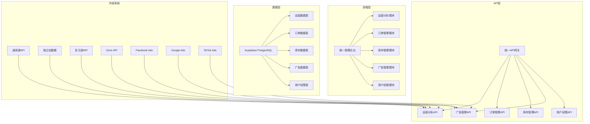
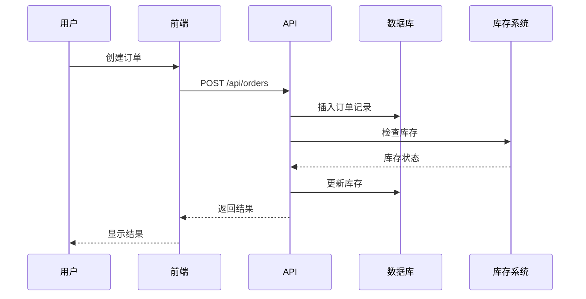
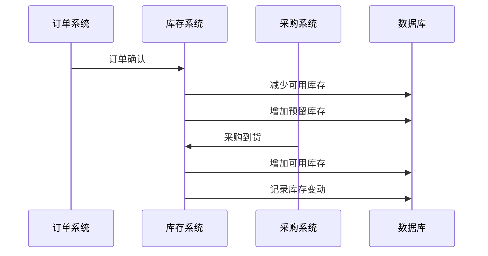

# 跨境电商管理平台 - Phase 2 完整架构设计

## 📋 项目概述

基于现有的跨境电商数据分析平台，Phase 2 扩展了完整的电商管理功能，包括：
- **订单管理系统** - 全流程订单管理
- **库存管理系统** - 多站点库存统一管理
- **广告管理系统** - 跨平台广告活动管理
- **用户权限系统** - 基于角色的访问控制
- **统一管理后台** - 一站式管理界面

## 🏗️ 系统架构

### 整体架构图



### 技术栈

- **前端**: HTML5 + JavaScript + DataTables + ECharts
- **后端**: Vercel Serverless Functions (Node.js)
- **数据库**: Supabase (PostgreSQL)
- **部署**: Vercel 静态托管 + API 路由
- **认证**: 基于角色的权限控制 (RBAC)

## 📊 数据库设计

### 核心表结构

#### 1. 用户权限管理
```sql
-- 角色表
CREATE TABLE IF NOT EXISTS public.roles (
    id UUID PRIMARY KEY DEFAULT gen_random_uuid(),
    name VARCHAR(50) UNIQUE NOT NULL,
    description TEXT,
    permissions JSONB NOT NULL DEFAULT '{}',
    created_at TIMESTAMP DEFAULT NOW()
);

-- 用户表
CREATE TABLE IF NOT EXISTS public.users (
    id UUID PRIMARY KEY DEFAULT gen_random_uuid(),
    username VARCHAR(50) UNIQUE NOT NULL,
    email VARCHAR(100) UNIQUE NOT NULL,
    password_hash VARCHAR(255) NOT NULL,
    full_name VARCHAR(100),
    role_id UUID REFERENCES roles(id),
    is_active BOOLEAN DEFAULT true,
    created_at TIMESTAMP DEFAULT NOW(),
    updated_at TIMESTAMP DEFAULT NOW()
);
```

#### 2. 产品管理（全局）
```sql
-- 分类表
CREATE TABLE IF NOT EXISTS public.categories (
    id UUID PRIMARY KEY DEFAULT gen_random_uuid(),
    name VARCHAR(100) NOT NULL,
    parent_id UUID REFERENCES categories(id),
    created_at TIMESTAMP DEFAULT NOW()
);

-- 产品表
CREATE TABLE IF NOT EXISTS public.products (
    id UUID PRIMARY KEY DEFAULT gen_random_uuid(),
    sku VARCHAR(100) UNIQUE NOT NULL,
    name TEXT NOT NULL,
    description TEXT,
    category_id UUID REFERENCES categories(id),
    brand VARCHAR(100),
    weight DECIMAL(10,3),
    dimensions JSONB,
    images JSONB,
    created_at TIMESTAMP DEFAULT NOW(),
    updated_at TIMESTAMP DEFAULT NOW()
);
```

#### 3. 库存管理（关联站点）
```sql
-- 库存表
CREATE TABLE IF NOT EXISTS public.inventory (
    id UUID PRIMARY KEY DEFAULT gen_random_uuid(),
    product_id UUID REFERENCES products(id),
    site_id TEXT REFERENCES sites(id),
    available_qty INTEGER DEFAULT 0,
    reserved_qty INTEGER DEFAULT 0,
    min_stock_level INTEGER DEFAULT 0,
    max_stock_level INTEGER DEFAULT 0,
    cost_price DECIMAL(10,2),
    selling_price DECIMAL(10,2),
    last_updated TIMESTAMP DEFAULT NOW(),
    UNIQUE(product_id, site_id)
);

-- 库存变动记录
CREATE TABLE IF NOT EXISTS public.inventory_movements (
    id UUID PRIMARY KEY DEFAULT gen_random_uuid(),
    product_id UUID REFERENCES products(id),
    site_id TEXT REFERENCES sites(id),
    movement_type VARCHAR(20) NOT NULL CHECK (movement_type IN ('in', 'out', 'transfer', 'adjustment')),
    quantity INTEGER NOT NULL,
    reference_type VARCHAR(50), -- 'order', 'purchase', 'adjustment'
    reference_id UUID,
    notes TEXT,
    created_by UUID REFERENCES users(id),
    created_at TIMESTAMP DEFAULT NOW()
);
```

#### 4. 订单管理
```sql
-- 客户表
CREATE TABLE IF NOT EXISTS public.customers (
    id UUID PRIMARY KEY DEFAULT gen_random_uuid(),
    external_id TEXT,
    site TEXT,
    email TEXT,
    phone TEXT,
    country TEXT,
    city TEXT,
    created_at TIMESTAMP DEFAULT NOW()
);

-- 订单表
CREATE TABLE IF NOT EXISTS public.orders (
    id UUID PRIMARY KEY DEFAULT gen_random_uuid(),
    order_no VARCHAR(50) UNIQUE NOT NULL,
    site_id TEXT REFERENCES sites(id),
    platform TEXT NOT NULL,
    channel TEXT,
    customer_id UUID REFERENCES customers(id),
    status VARCHAR(20) DEFAULT 'pending' CHECK (status IN ('pending', 'confirmed', 'shipped', 'delivered', 'completed', 'cancelled')),
    placed_at TIMESTAMP DEFAULT NOW(),
    currency VARCHAR(3) DEFAULT 'USD',
    subtotal DECIMAL(10,2) DEFAULT 0,
    discount DECIMAL(10,2) DEFAULT 0,
    shipping_fee DECIMAL(10,2) DEFAULT 0,
    tax DECIMAL(10,2) DEFAULT 0,
    total DECIMAL(10,2) DEFAULT 0,
    cost_of_goods DECIMAL(10,2) DEFAULT 0,
    logistics_cost DECIMAL(10,2) DEFAULT 0,
    settlement_status VARCHAR(20) DEFAULT 'pending' CHECK (settlement_status IN ('pending', 'partial', 'settled')),
    settlement_date DATE,
    warehouse_id TEXT,
    remark JSONB DEFAULT '{}',
    created_at TIMESTAMP DEFAULT NOW(),
    updated_at TIMESTAMP DEFAULT NOW()
);

-- 订单明细表
CREATE TABLE IF NOT EXISTS public.order_items (
    id UUID PRIMARY KEY DEFAULT gen_random_uuid(),
    order_id UUID NOT NULL REFERENCES orders(id) ON DELETE CASCADE,
    product_id UUID REFERENCES products(id),
    sku VARCHAR(100),
    product_name TEXT,
    quantity INTEGER NOT NULL,
    unit_price DECIMAL(10,2) NOT NULL,
    total_price DECIMAL(10,2) NOT NULL,
    cost_price DECIMAL(10,2),
    created_at TIMESTAMP DEFAULT NOW()
);
```

#### 5. 广告管理
```sql
-- 广告活动表
CREATE TABLE IF NOT EXISTS public.ad_campaigns (
    id UUID PRIMARY KEY DEFAULT gen_random_uuid(),
    site_id TEXT REFERENCES sites(id),
    platform VARCHAR(20) NOT NULL,
    campaign_id VARCHAR(100) NOT NULL,
    campaign_name TEXT NOT NULL,
    objective VARCHAR(50),
    status VARCHAR(20) DEFAULT 'active' CHECK (status IN ('active', 'paused', 'archived')),
    budget_daily DECIMAL(10,2),
    budget_total DECIMAL(10,2),
    start_date DATE,
    end_date DATE,
    target_audience JSONB,
    created_at TIMESTAMP DEFAULT NOW(),
    updated_at TIMESTAMP DEFAULT NOW(),
    UNIQUE(site_id, platform, campaign_id)
);

-- 广告数据表
CREATE TABLE IF NOT EXISTS public.ad_metrics_daily (
    id UUID PRIMARY KEY DEFAULT gen_random_uuid(),
    campaign_id UUID REFERENCES ad_campaigns(id),
    site_id TEXT REFERENCES sites(id),
    platform VARCHAR(20) NOT NULL,
    date DATE NOT NULL,
    impressions BIGINT DEFAULT 0,
    clicks BIGINT DEFAULT 0,
    spend DECIMAL(10,2) DEFAULT 0,
    conversions BIGINT DEFAULT 0,
    conversion_value DECIMAL(10,2) DEFAULT 0,
    ctr DECIMAL(5,4) DEFAULT 0,
    cpc DECIMAL(10,4) DEFAULT 0,
    cpm DECIMAL(10,4) DEFAULT 0,
    roas DECIMAL(10,4) DEFAULT 0,
    created_at TIMESTAMP DEFAULT NOW(),
    UNIQUE(campaign_id, date)
);
```

#### 6. 站点模块配置
```sql
-- 站点模块配置表（修复版）
CREATE TABLE IF NOT EXISTS public.site_module_configs (
    id UUID PRIMARY KEY DEFAULT gen_random_uuid(),
    site_id TEXT,
    platform TEXT NOT NULL,
    module_key TEXT NOT NULL CHECK (module_key IN ('operations','products','orders','advertising','inventory','permissions')),
    nav_label TEXT NOT NULL,
    nav_order SMALLINT NOT NULL DEFAULT 0,
    enabled BOOLEAN NOT NULL DEFAULT TRUE,
    is_global BOOLEAN NOT NULL DEFAULT FALSE,
    has_data_source BOOLEAN NOT NULL DEFAULT FALSE,
    visible_roles TEXT[] NOT NULL DEFAULT ARRAY[]::TEXT[],
    config JSONB DEFAULT '{}',
    created_at TIMESTAMP DEFAULT NOW(),
    updated_at TIMESTAMP DEFAULT NOW()
);

-- 创建唯一索引（处理 NULL 值）
CREATE UNIQUE INDEX IF NOT EXISTS idx_site_module_configs_unique 
ON public.site_module_configs (COALESCE(site_id, ''), platform, module_key);
```

### 重要修复说明

**语法错误修复**:
- 原设计中的 `UNIQUE (COALESCE(site_id, platform), module_key)` 在 PostgreSQL 中不支持
- 修复方案：使用唯一索引替代 UNIQUE 约束
- 使用 `COALESCE(site_id, '')` 将 NULL 值转换为空字符串，确保唯一性

**数据完整性保证**:
- 保持了原有的业务逻辑：`site_id` 和 `platform` 的组合唯一性
- 支持全局模块配置（`site_id` 为 NULL）
- 支持站点特定模块配置（`site_id` 有值）

## 🔌 API 设计

### API 路由结构

```
/api/
├── orders/           # 订单管理
│   ├── GET /         # 获取订单列表
│   ├── POST /        # 创建订单
│   ├── PUT /         # 更新订单
│   └── DELETE /      # 删除订单
├── inventory/        # 库存管理
│   ├── GET /         # 获取库存列表
│   ├── POST /        # 创建库存记录
│   ├── PUT /         # 更新库存
│   └── DELETE /      # 删除库存记录
├── ads/              # 广告管理
│   ├── GET /         # 获取广告活动
│   ├── POST /        # 创建广告活动
│   ├── PUT /         # 更新广告活动
│   └── DELETE /      # 删除广告活动
├── users/            # 用户管理
│   ├── GET /         # 获取用户列表
│   ├── POST /        # 创建用户
│   ├── PUT /         # 更新用户
│   └── DELETE /      # 删除用户
└── site-modules/     # 站点模块配置
    ├── GET /         # 获取模块配置
    ├── POST /        # 创建模块配置
    ├── PATCH /       # 更新模块配置
    └── DELETE /      # 删除模块配置
```

### API 响应格式

```json
{
  "success": true,
  "data": {
    "items": [...],
    "total": 100,
    "page": 1,
    "limit": 25,
    "pages": 4
  },
  "metadata": {
    "availableFields": [...],
    "missingFields": [...]
  }
}
```

## 🎨 前端架构

### 管理后台结构

```
public/admin/
├── index.html                    # 主页面
├── assets/
│   ├── admin-core.js            # 核心管理脚本
│   ├── admin-theme.css          # 管理后台样式
│   └── modules/
│       ├── analytics.js         # 运营分析模块
│       ├── orders.js            # 订单管理模块
│       ├── inventory.js         # 库存管理模块
│       ├── ads.js               # 广告管理模块
│       └── users.js             # 用户管理模块
```

### 模块化设计

每个功能模块都是独立的 JavaScript 类，具有以下特点：
- **独立性**: 每个模块可以独立开发和测试
- **可扩展性**: 易于添加新功能
- **一致性**: 统一的 API 调用和错误处理
- **响应式**: 支持移动端和桌面端

## 🔐 权限系统

### 角色定义

1. **super_admin** - 超级管理员
   - 所有模块的完整权限
   - 用户管理权限

2. **operations_manager** - 运营管理员
   - 运营分析、订单管理、广告管理
   - 库存查看权限

3. **order_manager** - 订单管理员
   - 订单管理完整权限
   - 库存查看权限

4. **inventory_manager** - 库存管理员
   - 库存管理完整权限
   - 订单查看权限

5. **ad_manager** - 广告管理员
   - 广告管理完整权限

6. **finance** - 财务
   - 订单和库存查看权限

7. **viewer** - 查看者
   - 所有模块的只读权限

### 权限控制

- **前端权限**: 基于用户角色显示/隐藏功能
- **API权限**: 服务端验证用户权限
- **数据权限**: 基于站点和角色的数据过滤

## 📈 数据流设计

### 订单数据流



### 库存数据流



## 🚀 部署架构

### Vercel 部署结构

```
vercel.json
├── functions/
│   ├── api/orders/index.js
│   ├── api/inventory/index.js
│   ├── api/ads/index.js
│   ├── api/users/index.js
│   └── api/site-modules/index.js
├── public/
│   ├── admin/
│   └── assets/
└── migrations/
    └── 001_create_management_tables.sql
```

### 环境变量

```bash
SUPABASE_URL=your_supabase_url
SUPABASE_ANON_KEY=your_anon_key
SUPABASE_SERVICE_ROLE_KEY=your_service_role_key
```

## 📋 开发计划

### Phase 2.1 - 基础功能 (已完成)
- ✅ 数据库表结构设计
- ✅ 核心 API 开发
- ✅ 管理后台框架
- ✅ 订单管理模块

### Phase 2.2 - 功能完善 (进行中)
- 🔄 库存管理模块
- 🔄 广告管理模块
- 🔄 用户权限模块
- 🔄 数据导入导出

### Phase 2.3 - 高级功能 (计划中)
- ⏳ 报表系统
- ⏳ 自动化工作流
- ⏳ 移动端适配
- ⏳ 性能优化

## 🔧 开发指南

### 添加新模块

1. **创建数据库表**
   ```sql
   -- 在 migrations/ 目录下创建新的迁移文件
   ```

2. **开发 API 接口**
   ```javascript
   // 在 api/ 目录下创建新的 API 文件
   ```

3. **创建前端模块**
   ```javascript
   // 在 public/assets/modules/ 目录下创建模块文件
   ```

4. **更新权限配置**
   ```sql
   -- 在 site_module_configs 表中添加新模块配置
   ```

### 代码规范

- **API**: 统一的错误处理和响应格式
- **前端**: 模块化设计，统一的 UI 组件
- **数据库**: 完整的索引和约束
- **文档**: 及时更新架构文档

## 📊 监控和维护

### 性能监控
- API 响应时间监控
- 数据库查询性能优化
- 前端加载速度优化

### 数据备份
- 定期数据库备份
- 重要数据导出
- 灾难恢复计划

### 安全措施
- API 访问控制
- 数据加密传输
- 定期安全审计

---

## 📞 联系信息

如有问题或建议，请联系开发团队。

**最后更新**: 2025-01-08
**版本**: Phase 2.0
**状态**: 开发中
